# Tema: DevOps

**Figura 1**

_Logo de ciclo DevOps_


Nota. Obtenido de Devopedia 2025 (https://devopedia.org/images/article/54/7602.1513404277.png)

## Desarrollo conceptual

### Línea del tiempo de DevOps

- 2003: Google contrata a Ben Traynor para liderar los despliegues en producción, dando origen al rol de Site Reliability Engineer (SRE).

- 2009: John Allspaw y Paul Hammond presentan la charla “Diez despliegues en el día: cooperación de Dev y Ops en Flickr”, marcando un hito en la cultura colaborativa. Ese mismo año se celebra la primera conferencia “DevOps Days” en Bélgica.

- 2010: Se organiza el primer DevOps Day en Estados Unidos y se introduce el hashtag #DevOps, lo que impulsa su popularización en comunidades técnicas.

- 2011–2012: DevOps gana tracción en grandes empresas. Se estima que para 2020 sería adoptado ampliamente en la industria tecnológica.

- Actualidad: Las prácticas DevOps se han consolidado globalmente. Herramientas de DevOps continúan evolucionando y los DevOps Days se celebran a nivel mundial.

**Figura 2**

_Linea de tiempo de DevOps_

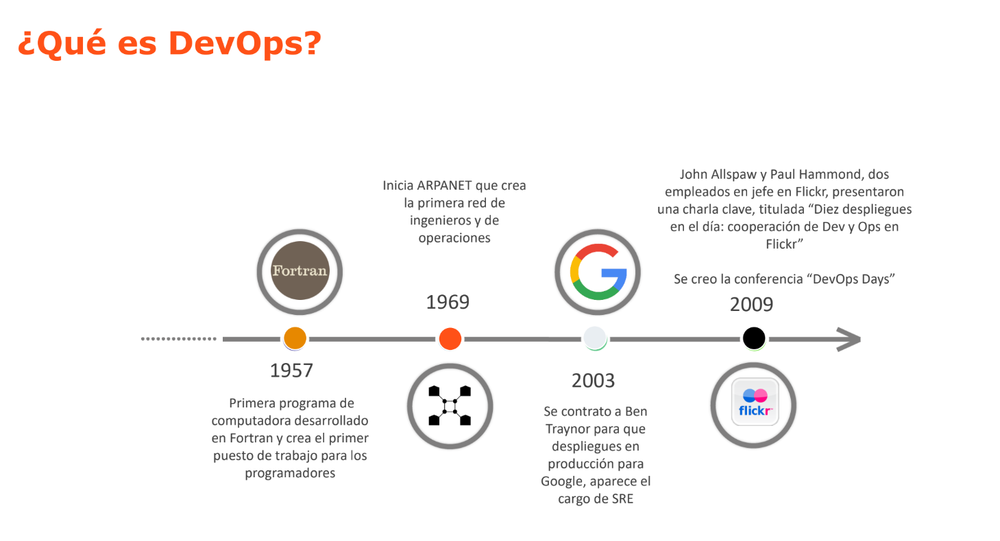
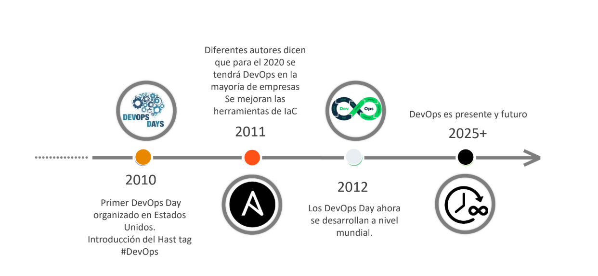

Nota. Obtenido de Universidad de Lima.

### ¿Qué es DevOps?

DevOps es una metodología que combina desarrollo de software (Dev) y operaciones de TI (Ops), esta nace de la composición de las mejores prácticas de tecnologías de la información (TI) en el mercado siendo los más relevantes ITIL, Lean, Agile, entre otros.

El objetivo de DevOps es el de fomentar una cultura de colaboración entre los equipos de TI y el de acortar el ciclo de vida del desarrollo, aumentar la calidad del software y facilitar la entrega de valor continua más rápido y barato. (Universidad de Lima, 2025)

### Antipatrones: problemas en el desarrollo del software

Los antipatrones en el desarrollo y operaciones de software representan prácticas comunes que, aunque parecen funcionales, generan ineficiencias, errores y retrabajo.

Entre los más comunes se encuentran los siguientes.

1. **Despliegue manual**
2. **Validación tardía en entornos similares a producción**
3. **Configuración manual de sistemas**.

Superarlos implica adoptar automatización, integración temprana y enfoques como infraestructura como código, alineándose con los principios de DevOps para lograr entregas más confiables, rápidas y sostenibles.

### DevOps vs SRE

DevOps es un enfoque cultural y metodológico, mientras que Site Reliability Engineering (SRE) es una disciplina creada por Google con un enfoque más ingenieril.

Si bien ambas metodologías buscan confiabilidad y eficiencia, SRE tiene un enfoque más fuerte en automatización y métricas como el Service Level Objective (SLO) y el _error budget_.

**Figura 3**

_Practicas principales de SRE_

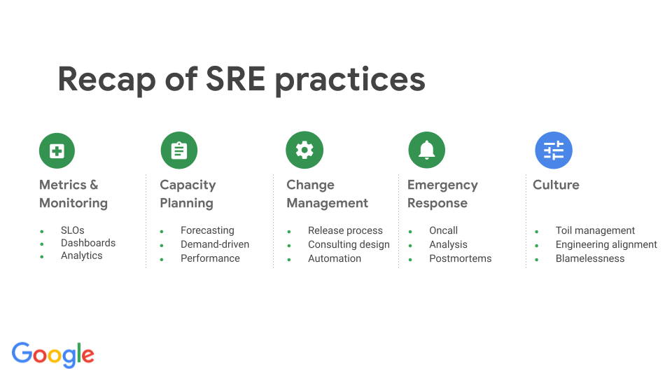

Nota. Obtenido de Google. _Site Reliability Engineering (SRE) Fundamentals_ (https://www.googlecloudcommunity.com/gc/Community-Blogs/Site-Reliability-Engineering-SRE-Fundamentals/ba-p/472590)

### Modelos de Madurez (Maturity Models)

Los modelos de madurez en DevOps evalúan el grado de adopción de prácticas DevOps en una organización.

Como ejemplo, se puede resaltar la implementación del OWASP DevSecOps Maturity Model (DSOMM) el cual presenta una implementación bastante completa de distintas métricas importantes para facilitar la.

Entre los ejes que mide este modelo se encuentran...

- Build
- Deployment
- Patch Management
- Design
- etc...

**Figura 4**

_Simulador de maturity model de DSOMM_

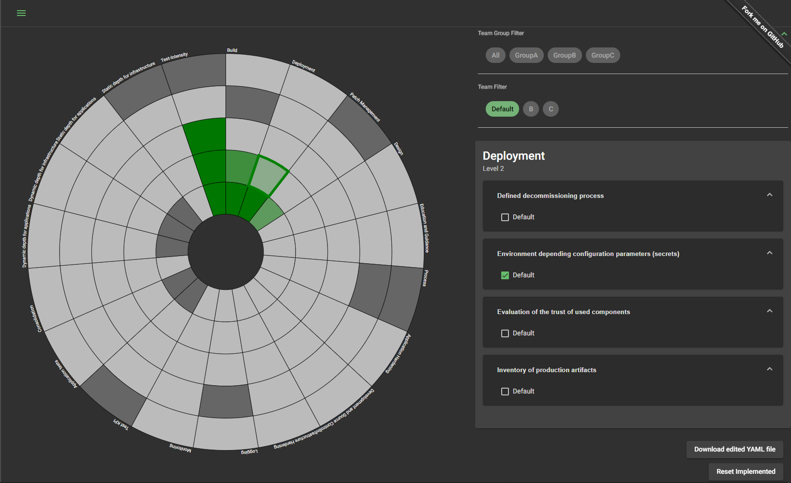

Nota. Obtenido de simulador web de OWASP DSOMM (https://dsomm.owasp.org/circular-heatmap)

### DevSecOps, FinOps, MLOps…

Dada la popularidad, múltiples extensiones de DevOps han emergido las cuales aplican sus principios a dominios más específicos:

- **DevSecOps**: integra seguridad desde el inicio del ciclo de vida.
  - Ejemplo: [Azure DevSecOps](https://azure.microsoft.com/en-us/solutions/devsecops)
- **FinOps**: gestión financiera colaborativa para servicios cloud.
  - Ejemplo: [Azure FinOps](https://azure.microsoft.com/en-us/solutions/finops), [Servicios de AWS FinOps (finout, 2024)](https://www.finout.io/blog/aws-finops-why-how-and-6-tools-to-get-you-started), etc.
- **MLOps**: gestión y automatización del ciclo de vida de modelos de machine learning.
  - Referencia, [¿Que son las MLOps? (AWS, s.f.)](https://aws.amazon.com/es/what-is/mlops/)

**Figura 5**

_Marcos Ops emergidos de DevOps_

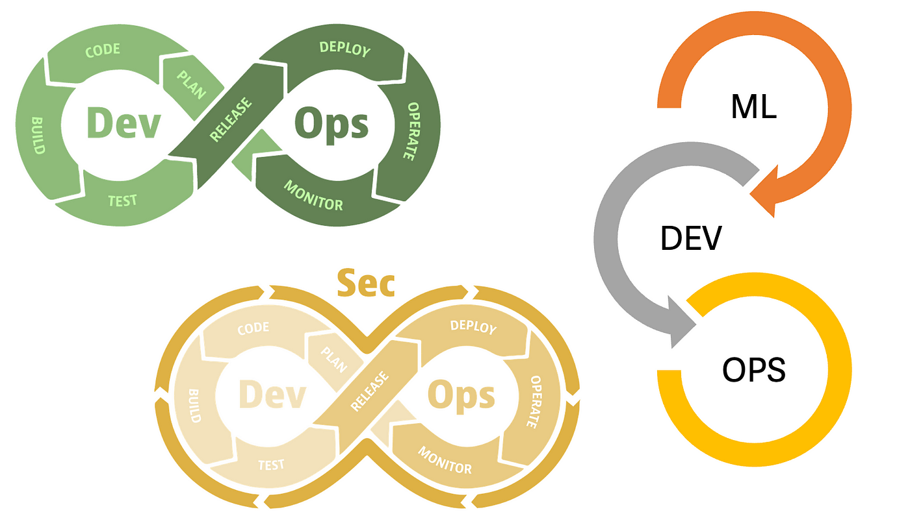

Nota. Obtenido de Medium. _…Ops: DevOps, MLOps, DevSecOps (Part 1)_ (https://mv-geoffrey-aaron.medium.com/ops-devops-mlops-devsecops-dataops-part-1-713dcb975d1d)

### ¿Qué es la integración continua y entrega continua (CI/CD)?

La **Integración Continua (CI)** es una práctica de desarrollo que consiste en integrar con frecuencia los cambios de código en un repositorio compartido, donde se verifican automáticamente mediante pruebas y compilaciones. Esto permite detectar errores de forma temprana y mantener un software siempre en estado funcional.

La **Entrega Continua (CD)** extiende la integración continua al automatizar el despliegue del código en entornos de prueba y producción. Con CD, el software puede liberarse de forma rápida, segura y repetible en cualquier momento, facilitando una entrega continua de valor al usuario final.

Ambas prácticas forman el núcleo técnico de DevOps, promoviendo calidad, velocidad y confiabilidad en el ciclo de vida del software.

---

## Consideraciones técnicas

### Requisitos técnicos

Se deben tener en consideración algunas consideraciones técnicas para seguir la demostración presentada en este documento.

- **SO**: Windows 10 o posterior, macOS o Linux.
- **RAM**: Mínimo 4 GB recomendado.
- **CPU**: Procesador moderno de múltiples núcleos.

### Conocimientos previos

Así mismo, se recomienda tener conocimientos previos en cuanto a los siguientes puntos:

- Familiaridad con el código fuente y control de versiones (**Git**).
- Comprensión básica de **pruebas unitarias**.
- Conocimiento general de **despliegue a servicios cloud** como AWS, Azure o GCP.

### Instalación de VS Code

Instalar Visual Studio Code según el sistema operativo:

- Descargar desde [https://code.visualstudio.com/](https://code.visualstudio.com/)
- Seguir el instalador correspondiente según el sistema operativo.

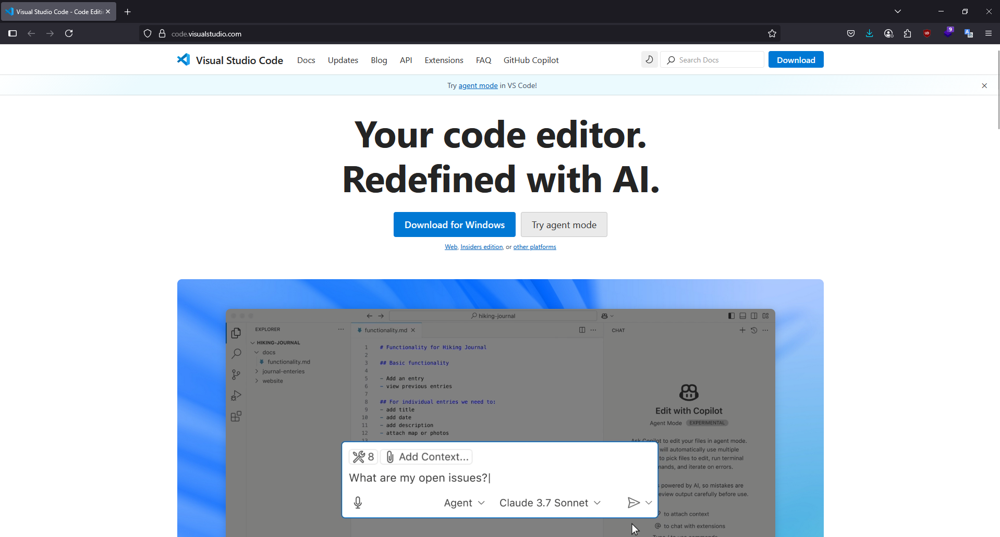

### Extensión de GitHub Actions

Una vez VS Code haya sido instalado se debe configurar la extensión de Github Actions

- Buscar "GitHub Actions" en la marketplace de extensiones de VS Code.
- Dar click a instalar

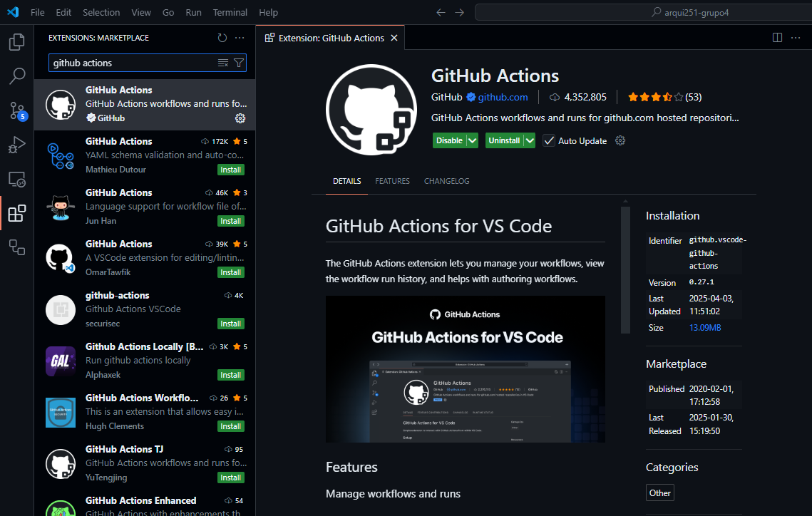

### ¿Qué es un YAML?

YAML (_YAML Ain't Markup Language_) es un formato legible por humanos para la serialización de datos. Se usa comúnmente en configuración de CI/CD. Es similar a JSON pero más simple y menos verboso.

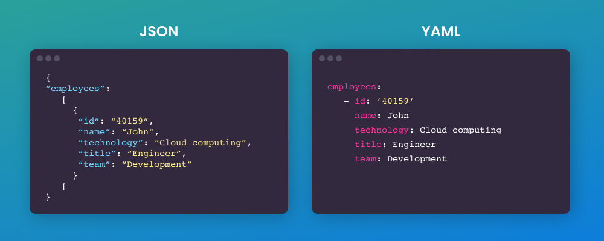

### Estructura de YAML

- Usa indentación por espacios (no tabulaciones).
- Representa datos como clave: valor.
- Puede incluir listas, objetos anidados y variables.

```yaml
name: CI Pipeline
on: [push]
jobs:
  build:
    runs-on: ubuntu-latest
    steps:
      - uses: actions/checkout@v3
      - name: Run Tests
        run: npm test
```

---

## **Demo (Código)**

### (Opcional) GitHub for Students

Si se cuenta con una identificación académica, GitHub tiene un plan especial para asociar tu cuenta como estudiante y acceder a herramientas gratuitas para estudiantes como dominios, créditos cloud y servicios premium.

**Figura 6**

_Página web de Github Student Developer Pack_

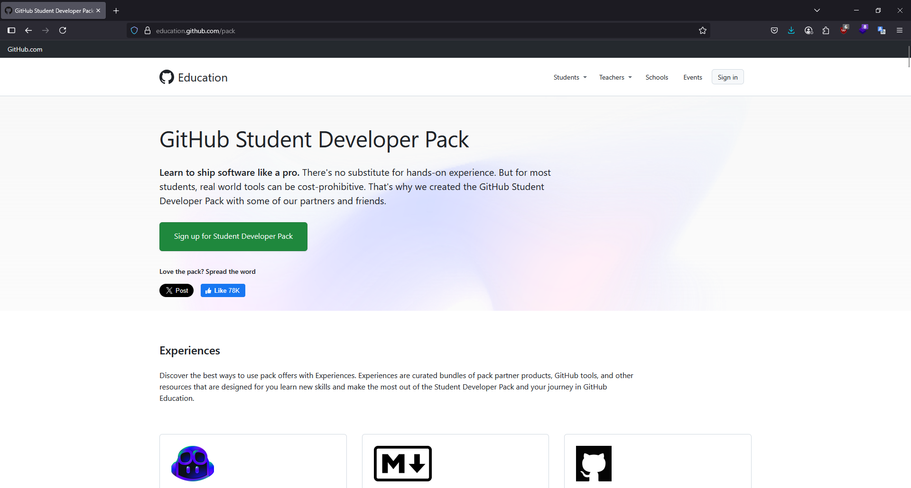

Nota. Obtenido de Github. _GitHub Student Developer Pack_ (https://education.github.com/pack)

### Código de ejemplo

Repositorio con una aplicación simple (Vite React Typescript y FastAPI Python) con pruebas y configuración CI/CD lista para usar.

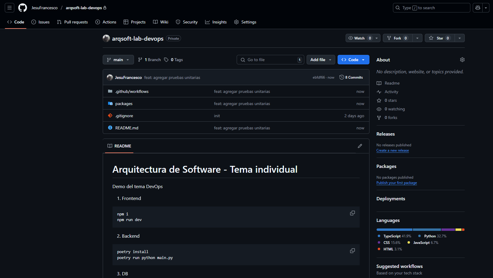

### Uso de GitHub Actions

Se realizará un flujo de trabajo básico de CI usando GitHub Actions, incluyendo patrones comunes como:

- Checkout del repositorio.
- Instalación de dependencias.
- Ejecución de pruebas.
- Despliegue a entornos.

### Pruebas automatizadas

Demostración de cómo configurar y ejecutar pruebas unitarias automáticamente dentro del flujo CI.

#### Pruebas con vitest

```ts
import { fireEvent, render, screen, waitFor } from "@testing-library/react";
import { describe, it, expect, vi } from "vitest";
import Hero from "../src/components/Hero";
import CounterButton from "../src/components/CounterButton";
import * as counterService from "../src/service/counter.service";

describe("Hero test", () => {
  it("renders the correct text with the right class", () => {
    render(<Hero />);

    const element = screen.getByText("DevOps");

    // Verifica que el elemento esté en el documento y tenga la clase correcta
    expect(element).toBeInTheDocument();
    expect(element).toHaveClass("gradient-text");
  });
});

describe("Button test", () => {
  it("renders the button with initial counter and increments on click", async () => {
    // Mock fn getCounter para traer 5
    vi.spyOn(counterService, "getCounter").mockResolvedValue({ counter: 5 });

    // Mock fn incrementCounter para incrementar a 6
    vi.spyOn(counterService, "incrementCounter").mockResolvedValue({
      counter: 6,
    });

    render(<CounterButton />);

    // Esperar a quitar loading
    expect(screen.getByText("Loading...")).toBeInTheDocument();

    // Esperar al botón con el contador inicial
    const button = await screen.findByRole("button", { name: /Contador: 5/i });
    expect(button).toBeInTheDocument();

    // Click al botón para incrementar el contador
    fireEvent.click(button);

    // Esperar al botón con el contador incrementado
    await waitFor(() =>
      expect(
        screen.getByRole("button", { name: /Contador: 6/i })
      ).toBeInTheDocument()
    );
  });
});
```

#### Pruebas con pytest

```python
import pytest
from unittest.mock import patch, MagicMock


@pytest.fixture
def mock_psycopg2_pool():
    # Mockear la clase SimpleConnectionPool de psycopg2
    with patch("psycopg2.pool.SimpleConnectionPool") as mock_pool_cls:
        # Mockear connection y cursor
        mock_conn = MagicMock()
        mock_cursor = MagicMock()

        # Cuando se llame a fetchone, devolver un valor específico
        # (en este caso, un contador inicial de 0)
        mock_cursor.fetchone.return_value = (0,)
        mock_conn.cursor.return_value.__enter__.return_value = mock_cursor

        # Configurar el pool y el contexto
        mock_pool = MagicMock()
        mock_pool.getconn.return_value = mock_conn
        mock_pool.getconn.return_value.__enter__.return_value = mock_conn

        mock_pool_cls.return_value = mock_pool

        yield mock_pool


# Prueba 1
def test_get_counter_returns_zero(mock_psycopg2_pool):
    with mock_psycopg2_pool.getconn() as conn:
        with conn.cursor() as cur:
            cur.execute("SELECT counter FROM counters LIMIT 1;")
            row = cur.fetchone()

            assert {"counter": row[0]} == {"counter": 0}

```

### Ambientes desarrollo, pruebas y producción

Explicación y ejemplo del uso de ambientes separados:

- Desarrollo (Dev): desarrollo activo.
- Pruebas (Test): ambiente de pruebas (similar a producción).
- Producción (Prod): entorno en producción.

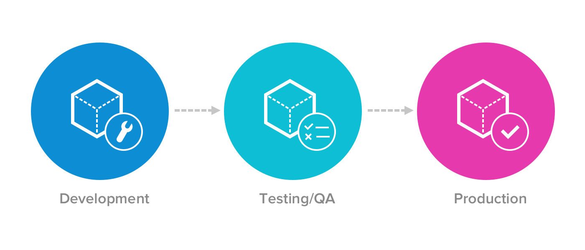

### Ejecución de pipeline

Muestra del pipeline ejecutándose en GitHub Actions después de un push al repositorio.


### Verificación de despliegue

Confirmación de que el código se desplegó correctamente en el entorno destino (aplicación móvil compilada y REST API desplegada en Azure).


