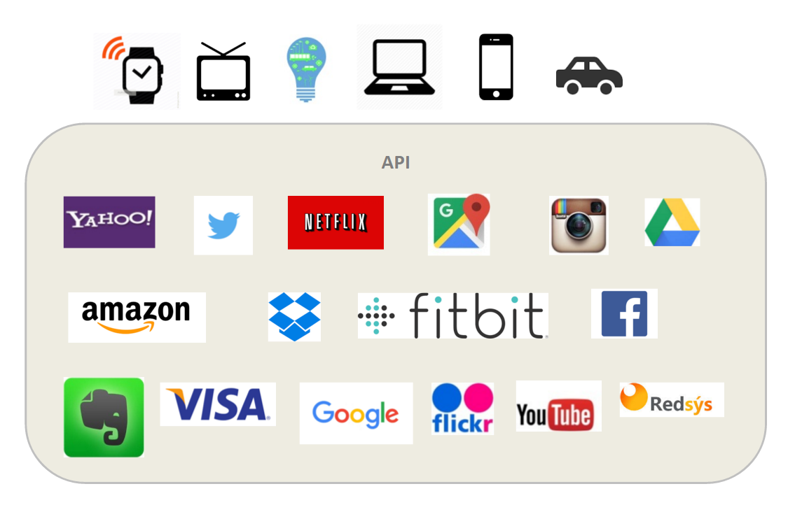
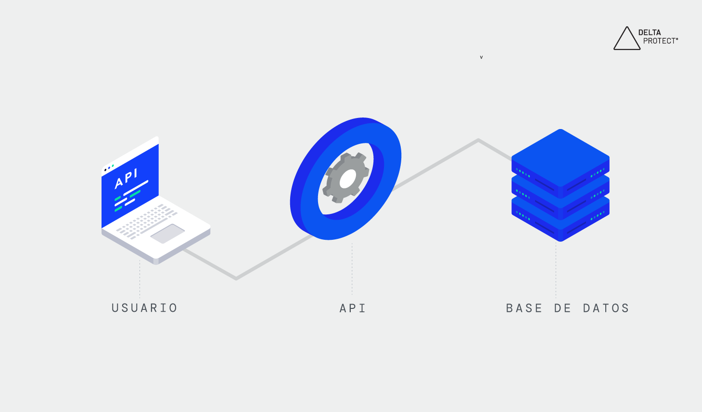

# Tema: Integración con APIs de terceros



## **Desarrollo conceptual**

### ¿Qué son las APIs?

Una API (Application Programming Interface) es una interfaz de programación de aplicaciones que permite que diferentes software se comuniquen entre sí. Es un conjunto de reglas, protocolos y herramientas que especifica cómo los componentes de software deben interactuar. En otras palabras, las APIs actúan como intermediarios que permiten que las aplicaciones intercambien datos y funcionalidades de manera estructurada y segura, sin necesidad de conocer los detalles internos de implementación de cada sistema.



### ¿Cómo funcionan las APIs?

El proceso básico sigue un patrón de solicitud-respuesta donde una aplicación cliente envía una petición (request) a través de la API, y el servidor procesa esta solicitud y devuelve una respuesta (response) con los datos solicitados o confirmación de la acción realizada.

El flujo típico de una API incluye los siguientes pasos: 

1. Primero, la aplicación cliente construye una solicitud HTTP que incluye el método (GET, POST, PUT, DELETE), la URL del endpoint, headers con metadatos, y opcionalmente un cuerpo con datos.
2. Luego, la API recibe la solicitud, valida la autenticación y autorización, procesa la petición accediendo a bases de datos o servicios internos.
3. Finalmente devuelve una respuesta estructurada que incluye un código de estado HTTP, headers de respuesta, y los datos solicitados en formato JSON, XML u otro formato acordado.

### Componentes de una API

1. Endpoints (Puntos de acceso):

    Son las URLs específicas donde la API puede ser accedida. Cada endpoint representa un recurso particular o funcionalidad específica. Por ejemplo: https://api.ejemplo.com/usuarios para gestionar usuarios o https://api.ejemplo.com/productos/123 para acceder a un producto específico.

2. Métodos HTTP:

    Definen el tipo de operación a realizar sobre el recurso:

    - GET: Recuperar datos sin modificarlos
    - POST: Crear nuevos recursos
    - PUT: Actualizar recursos existentes completamente
    - PATCH: Actualizar parcialmente un recurso
    - DELETE: Eliminar recursos

3. Headers (Cabeceras):

    Son componentes de las solicitudes y respuestas HTTP que proporcionan información adicional sobre los datos que se transmiten. Incluyen metadatos como tipo de contenido, autenticación, versión de la API, y configuraciones de cache.

4. Parámetros:

    - Query Parameters: Se envían en la URL (?parametro=valor)
    - Path Parameters: Forman parte de la ruta del endpoint (/usuarios/{id})
    - Body Parameters: Enviados en el cuerpo de la solicitud (principalmente POST/PUT)

5. Códigos de Estado HTTP:

    Indican el resultado de la operación:

    - 2xx: Éxito (200 OK, 201 Created, 204 No Content)
    - 4xx: Error del cliente (400 Bad Request, 401 Unauthorized, 404 Not Found)
    - 5xx: Error del servidor (500 Internal Server Error, 503 Service Unavailable)

6. Formato de Datos:

    Estructura en la que se intercambia información, comúnmente JSON, XML, o formats binarios.

### Tipos de APIs

**RESTful (Representational State Transfer)**

REST es un estilo arquitectónico que utiliza los métodos HTTP estándar para realizar operaciones sobre recursos identificados por URLs. REST permite que las aplicaciones cliente intercambien datos con un servidor utilizando verbos HTTP, que es el protocolo de comunicación estándar de internet. Se basa en principios como la ausencia de estado (stateless), la arquitectura cliente-servidor, y la capacidad de cache.

**OData (Open Data Protocol)**

OData es un protocolo estándar para construir y consumir APIs RESTful que proporciona un conjunto rico de funcionalidades para consultar y manipular datos. Permite operaciones avanzadas como filtrado, ordenamiento, paginación, y selección de campos específicos directamente a través de parámetros de consulta en la URL.

**SOAP (Simple Object Access Protocol)**

SOAP es un protocolo de comunicación basado en XML que define un formato estandardizado para el intercambio de información estructurada. SOAP realiza operaciones que representan lógica, a diferencia de REST que opera con recursos que representan datos.

**GraphQL**

GraphQL es un lenguaje de consulta diseñado para proporcionar una alternativa más eficiente y flexible a las APIs REST tradicionales. GraphQL es un lenguaje de consulta de API que define especificaciones de cómo una aplicación cliente debe solicitar datos de un servidor remoto.

### ¿Qué significa integración con APIs de terceros?

La integración con APIs de terceros se refiere al proceso de conectar una aplicación propia con servicios, datos o funcionalidades proporcionadas por empresas externas a través de sus APIs públicas. A diferencia de las APIs propias (first-party), que son desarrolladas internamente por la misma organización usando recursos, personal y sistemas propios, las APIs de terceros son creadas y mantenidas por desarrolladores externos.

### Diferencias clave entre APIs propias y de terceros:

**APIs Propias (First-party)**

- Desarrolladas internamente por la misma organización
- Control completo sobre diseño, ciclo de vida e implementación
- Ideales para aplicaciones altamente específicas o con requisitos de seguridad estrictos
- Requieren inversión significativa en tiempo, recursos y talento especializado
- Mayor flexibilidad para personalización y modificaciones

**APIs de Terceros (Third-party)**

- Creadas y mantenidas por empresas externas
- Acceso a funcionalidades probadas y establecidas sin desarrollo interno
- Dependencia de proveedores externos para mantenimiento y actualizaciones
- Menor control sobre cambios y actualizaciones
- Implementación más rápida y económica

| Características          | APIs Propias (First-party)                     | APIs de Terceros (Third-party)           |
| ------------------------ | ---------------------------------------------- | ---------------------------------------- |
| Control                  | Control completo sobre diseño e implementación | Menor control, dependiente del proveedor |
| Tiempo de implementación | Mayor tiempo de desarrollo desde cero          | Implementación rápida y acceso inmediato |
| Costos                   | Alta inversión inicial y mantenimiento         | Costos menores y predecibles             |
| Flexibilidad             | Máxima personalización                         | Limitada a funcionalidades del proveedor |
| Mantenimiento            | Responsabilidad interna                        | A cargo del proveedor externo            |

### ¿Por qué integrar APIs de terceros?

**Ventajas principales**

1. **Ahorro de tiempo:** Las APIs de terceros permiten a los desarrolladores aprovechar funcionalidades preexistentes, ahorrando tiempo significativo en el desarrollo. En lugar de reinventar la rueda, los desarrolladores pueden concentrarse en integrar y personalizar soluciones existentes, acelerando considerablemente el proceso de desarrollo.

2. **Costo-efectivo:** Construir y mantener ciertas funcionalidades internamente puede ser extremadamente costoso. Las APIs de terceros frecuentemente ofrecen modelos de precios accesibles, permitiendo a las empresas acceder a características avanzadas sin costos iniciales significativos.

3. **Escalabilidad:** Muchas APIs de terceros están diseñadas para manejar grandes volúmenes de solicitudes y escalar sin esfuerzo conforme aumenta la demanda. Esta escalabilidad es particularmente beneficiosa para empresas en crecimiento o aplicaciones que experimentan picos súbitos de tráfico.

4. **Experiencia especializada:** Las APIs de terceros son frecuentemente desarrolladas y mantenidas por expertos en sus respectivos dominios. Al integrar estas APIs, los desarrolladores pueden aprovechar la experiencia y mejores prácticas del proveedor de la API, resultando en soluciones más robustas y confiables.

5. **Rica en características:** Las APIs de terceros típicamente ofrecen una amplia gama de características y funcionalidades que pueden no ser factibles de desarrollar internamente. Estas características pueden mejorar las capacidades de las aplicaciones y proporcionar a los usuarios experiencias más enriquecedoras.


**Desventajas a considerar**

1. **Dependencia de terceros:** Depender de APIs de terceros significa que la funcionalidad de su aplicación depende de la disponibilidad y confiabilidad del proveedor de la API. Si la API experimenta tiempo de inactividad o interrupciones, puede impactar negativamente el rendimiento de su aplicación y la experiencia del usuario.

2. **Personalización limitada:** Aunque las APIs de terceros ofrecen funcionalidades preexistentes, no siempre se alinean perfectamente con sus requisitos específicos. Las opciones de personalización pueden ser limitadas, forzando a los desarrolladores a trabajar dentro de las limitaciones del diseño de la API.

3. **Preocupaciones de seguridad:** Integrar APIs de terceros introduce riesgos potenciales de seguridad, especialmente si se transmiten datos sensibles o la API tiene vulnerabilidades. Es esencial examinar minuciosamente las medidas de seguridad implementadas por el proveedor de la API e implementar medidas de seguridad adicionales según sea necesario.

4. **Potencial para cambios**: Las APIs de terceros pueden experimentar actualizaciones o cambios con el tiempo, incluyendo cambios en endpoints, formatos de datos, o mecanismos de autenticación. Estos cambios pueden requerir ajustes al código de su aplicación y pueden interrumpir la funcionalidad si no se manejan apropiadamente.

5. **Problemas de rendimiento:** Dependiendo de factores como la latencia de red y la capacidad de respuesta de los servidores del proveedor de la API, integrar APIs de terceros puede introducir cuellos de botella de rendimiento, impactando la velocidad general y capacidad de respuesta de su aplicación.

## Consideraciones técnicas
# Consideraciones Técnicas - Dashboard del Clima (Demo Simplificada)

## **Requisitos técnicos mínimos**
* **SO**: Windows, macOS o Linux
* **RAM**: mínimo 4 GB
* **CPU**: procesador moderno
* **Conexión a Internet**: estable para consultas de API en tiempo real
* **Navegador**: Chrome, Firefox, Safari o Edge (versiones actualizadas)

## **Conocimientos previos necesarios**
* Fundamentos de **React** y **JavaScript ES6+**: hooks (useState, useEffect), componentes funcionales, manejo de estado
* Conceptos básicos de **APIs REST**: métodos HTTP (GET), estructura JSON y manejo de respuestas
* **CSS básico**: conocimiento de Flexbox y Grid
* Manejo de **promesas y async/await** para operaciones asíncronas
* Conceptos de **geolocalización** y API del navegador
* Manejo básico de **errores HTTP** y estados de carga
* Uso básico de la **terminal/consola** de comandos

## **Instalación de herramientas**

### **Node.js y npm**
* Descargar desde https://nodejs.org/
* Versión recomendada: Node.js 18.x o superior
* Verificar instalación: `node --version` y `npm --version`

### **IDE Visual Studio Code**
* Descargar desde https://code.visualstudio.com/

## **Configuración del proyecto**

### **Inicialización con Vite**
```bash
npm create vite@latest weather-dashboard -- --template react
cd weather-dashboard
npm install
```

### **Librerías necesarias (solo las esenciales)**
```bash
# Dependencias principales
npm install lucide-react            # Iconos modernos para React

# TailwindCSS para estilos (opcional pero recomendado)
npm install -D tailwindcss postcss autoprefixer
npx tailwindcss init -p
```

## **API de terceros: WeatherAPI**

### **WeatherAPI - Configuración**
* **URL de registro**: https://www.weatherapi.com/
* **Plan gratuito**: 1,000,000 llamadas/mes (muy generoso)
* **Datos disponibles**: clima actual, pronóstico hasta 10 días, calidad del aire
* **Formato**: JSON
* **Autenticación**: API Key en query parameters

### **Endpoints utilizados**
```javascript
// Clima actual
GET https://api.weatherapi.com/v1/current.json?key={API_KEY}&q={city}&aqi=yes&lang=es

// Pronóstico
GET https://api.weatherapi.com/v1/forecast.json?key={API_KEY}&q={city}&days=3&aqi=no&alerts=no&lang=es
```

## **Arquitectura del proyecto**

### **Estructura de carpetas**
```
weather-dashboard/
├── public/
│   ├── vite.svg
│   └── favicon.ico
├── src/
│   ├── components/
│   │   ├── WeatherCard.jsx
│   │   ├── SearchBar.jsx
│   │   ├── ForecastCard.jsx
│   │   ├── LoadingSpinner.jsx
│   │   └── ErrorMessage.jsx
│   ├── services/
│   │   ├── weatherAPI.js
│   │   └── geolocationService.js
│   ├── hooks/
│   │   ├── useWeather.js
│   │   └── useGeolocation.js
│   ├── utils/
│   │   ├── weatherIcons.js
│   │   ├── formatters.js
│   │   └── constants.js
│   ├── App.jsx
│   ├── main.jsx
│   └── index.css
├── .env.example
├── .env
├── .gitignore
├── package.json
├── README.md
├── tailwind.config.js
├── postcss.config.js
└── vite.config.js
```

## **Configuración de variables de entorno**

### **Archivo .env**
```
VITE_WEATHER_API_KEY=tu_api_key_de_weatherapi_aqui
```

## **Buenas prácticas esenciales**

### **Manejo de API Keys**
* **NO** incluir API keys directamente en el código fuente
* Utilizar variables de entorno con prefijo `VITE_` para Vite
* Añadir `.env` al archivo `.gitignore`

### **Manejo de errores básico**
* Implementar **try-catch** en todas las llamadas a APIs
* Mostrar mensajes de error simples al usuario
* Estados de carga para mejor UX

## **Funcionalidades implementadas**

### **Features principales**
1. **Búsqueda por ciudad** 
2. **Geolocalización automática** del usuario
3. **Clima actual** con detalles meteorológicos básicos
4. **Pronóstico de 3 días**
5. **Manejo de errores** y estados de carga

### **Datos mostrados**
* Temperatura actual y sensación térmica
* Condición climática con iconos (usando Lucide React)
* Humedad, viento, visibilidad
* Presión atmosférica e índice UV
* Pronóstico con temperaturas máximas/mínimas

## Bibliografía

* ¿Qué es una API (interfaz de programación de aplicaciones)? <https://www.sap.com/latinamerica/products/technology-platform/integration-suite/what-is-api.html>
* What are the pros and cons of using third-party APIs? (2024, abril 22). <https://cyclr.com/blog/what-are-the-pros-and-cons-of-using-third-party-apis>