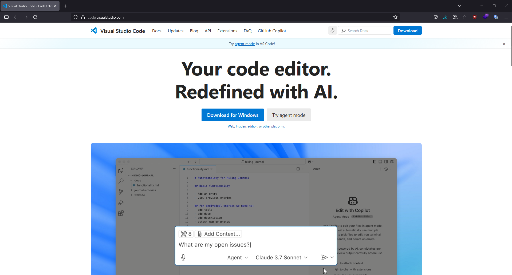

# Tema: Pruebas de Integración con Postman

## **Desarrollo conceptual**

### ¿Qué son las Pruebas de Integración?

Las **pruebas de integración** son un tipo de prueba de software cuyo propósito es verificar que los diferentes módulos o componentes de una aplicación interactúan correctamente entre sí. A diferencia de las pruebas unitarias que evalúan funcionalidades aisladas, las pruebas de integración se enfocan en las **interacciones** entre múltiples partes del sistema, como servicios, APIs, bases de datos y controladores.

Estas pruebas ayudan a validar los **flujos de datos y comunicación entre componentes**, garantizando que los subsistemas funcionen de forma coherente cuando se integran.


### ¿Qué aportan las Pruebas de Integración?

Las pruebas de integración son esenciales para:

- **Detectar errores de comunicación** entre módulos (por ejemplo, incompatibilidades en formatos de datos o errores en puntos de integración).
- **Identificar fallos tempranos** en la integración de servicios externos (como APIs de terceros).
- Asegurar que los **cambios en un módulo no afecten negativamente a otros módulos**.
- Validar la **coherencia de datos** cuando se transmiten entre capas (por ejemplo, del backend al frontend o entre microservicios).
- Mejorar la **calidad y fiabilidad del software** al identificar errores que no son visibles en pruebas unitarias.


### ¿Qué es Postman?

**Postman** es una plataforma ampliamente utilizada por desarrolladores y testers para realizar pruebas sobre APIs (Application Programming Interfaces). Permite enviar solicitudes HTTP a un servidor y analizar las respuestas, lo que lo convierte en una herramienta ideal para pruebas de integración, especialmente en sistemas que dependen de servicios RESTful.

Postman también ofrece características como entornos de prueba, colecciones de peticiones, automatización de pruebas con scripts y generación de documentación para APIs.


### Ventajas de usar Postman

Postman ofrece múltiples ventajas para pruebas de integración:

- **Interfaz intuitiva** y fácil de usar, ideal tanto para principiantes como para expertos.
- **Soporte para múltiples tipos de peticiones** HTTP (GET, POST, PUT, DELETE, etc.).
- Posibilidad de **automatizar pruebas** usando scripts en JavaScript.
- Gestión de **colecciones** y entornos para facilitar pruebas organizadas y reutilizables.
- **Validación de respuestas** con pruebas automatizadas que verifican código de estado, estructura del JSON, tiempos de respuesta, etc.
- **Generación de documentación automática** a partir de colecciones.
- Integración con CI/CD mediante herramientas como Newman (Postman CLI).

### Tipos de peticiones en Postman

Postman permite ejecutar diferentes tipos de solicitudes HTTP, cada una con su propósito específico:

| Método HTTP | Descripción                                      |
|-------------|--------------------------------------------------|
| GET         | Solicita datos de un recurso especificado.       |
| POST        | Envía datos para crear un nuevo recurso.         |
| PUT         | Actualiza un recurso existente.                  |
| PATCH       | Actualiza parcialmente un recurso.               |
| DELETE      | Elimina un recurso especificado.                 |
| OPTIONS     | Devuelve los métodos HTTP permitidos para un recurso. |

### Limitaciones de las Pruebas de Integración

Aunque son fundamentales, las pruebas de integración también presentan algunas limitaciones:

- **Mayor complejidad** en comparación con las pruebas unitarias, debido a la cantidad de dependencias involucradas.
- **Difíciles de mantener** si no se automatizan correctamente o si los sistemas cambian con frecuencia.
- Requieren un **entorno estable** para garantizar resultados consistentes.
- No siempre detectan todos los errores lógicos o de negocio (se combinan con pruebas de sistema para una cobertura más amplia).
- La simulación de servicios externos (mocking) puede ocultar fallos reales si no se hace cuidadosamente.

## **Consideraciones técnicas**

### Requisitos técnicos

Para seguir esta demostración de pruebas de integración con Postman, se recomienda cumplir con los siguientes requerimientos:

* **Sistema operativo:** Windows 10 o superior, macOS o Linux.
* **Memoria RAM:** 8 GB (mínimo 4 GB).
* **Procesador:** Procesador moderno de múltiples núcleos.

### Conocimientos previos

Se requiere tener conocimientos previos en:

* Fundamentos de APIs REST.
* Comprensión de métodos HTTP (GET, POST, PUT, DELETE).
* Manejo de JSON como formato de datos.
* Uso básico de variables y entornos en Postman.
* Nociones básicas de autenticación con tokens.

### Instalación y configuración de Postman

* Descargar Postman desde [https://www.postman.com/downloads/](https://www.postman.com/downloads/)
* Ejecutar el instalador según el sistema operativo.
* Crear una cuenta gratuita y acceder a la aplicación.


## Instalación del entorno de desarrollo

### Instalación de VS Code

Para instalar el IDE **Visual Studio Code** debe seguirse los siguientes pasos:

* Descargar desde: [https://code.visualstudio.com/](https://code.visualstudio.com/)
* Seleccionar el instalador correspondiente según tu sistema operativo (Windows, macOS, Linux).
* Ejecutar el instalador y seguir los pasos del asistente de instalación.



### Instalación de Node.js

Para instalar **Node.js** (incluye `npm`, el gestor de paquetes):

* Ir al sitio oficial: [https://nodejs.org/es/download](https://nodejs.org/es/download)
* Descargar el instalador correspondiente a tu sistema operativo.
* Seguir las instrucciones del instalador.
* Verificar la instalación con los siguientes comandos en la terminal:

```bash
node -v
npm -v
```


### Librerías necesarias

Para crear el backend en Node.js con Express y permitir pruebas de integración:

* Inicializar el proyecto con `npm`:

```bash
npm init -y
```

* Instalar **Express**, el framework web para Node.js:

```bash
npm install express
```

* Instalar herramientas adicionales de desarrollo como:

```bash
npm install --save-dev nodemon
```

Esto permite reiniciar el servidor automáticamente en desarrollo. Puedes agregar un script en `package.json` como:

```json
"scripts": {
  "start": "node index.js",
  "dev": "nodemon index.js"
}
```

## Demo de código: Pruebas de integración con Postman

### Escenario de aplicación

**Caso**: Validar la integración completa del flujo de autenticación y operaciones CRUD sobre usuarios, utilizando un backend básico desarrollado con Node.js y Express. El backend permite gestionar una lista de usuarios en memoria, e incluye una ruta de login con autenticación simulada por token.

### Objetivo

Realizar pruebas de integración con autenticación simulada mediante Postman, verificando el correcto funcionamiento de los siguientes aspectos:

* Login de usuario (simulación de autenticación básica).
* Operaciones completas CRUD sobre usuarios (crear, leer, actualizar y eliminar).
* Verificación de métodos HTTP permitidos mediante la petición OPTIONS.

### Prueba de Login

* Ruta: POST /login
* Permite autenticar a un usuario administrador y obtener un token para acceder a las rutas protegidas.


### Obtener lista de usuarios

* Ruta: GET /users
* Obtiene todos los usuarios registrados (requiere token válido).


### Crear nuevo usuario

* Ruta: POST /users
* Agrega un nuevo usuario (requiere token válido).


### Actualizar usuario completo

* Ruta: PUT /users/:id
* Actualiza un usuario completo (requiere token válido).


### Actualizar usuario parcialmente

* Ruta: PATCH /users/:id
* Actualiza campos específicos de un usuario (requiere token válido).


### Eliminar usuario

* Ruta: DELETE /users/:id
* Elimina un usuario según id (requiere token válido).


### Consultar métodos permitido

* Ruta: OPTIONS /users
* Consulta qué métodos HTTP están permitidos en la ruta /users.


### Repositorio y video

Este backend básico en Node.js y Express permite realizar operaciones CRUD sobre usuarios, incluyendo un flujo simulado de autenticación mediante token.

[Video Presentación](../0.8/lujan.md)
[Código DEMO](../0.8/demo_lujan)