# Desarrollo Conceptual

## Visión Computacional

La **visión computacional** es una rama dentro de la inteligencia artificial que se enfoca en permitir que las computadoras adquieran, procesen, analicen e interpreten información visual del entorno, simulando la capacidad de visión humana. Su propósito es automatizar tareas que requieren comprensión visual, como la identificación, clasificación, seguimiento y segmentación de objetos dentro de imágenes o secuencias de video.

Entre las aplicaciones más destacadas de la visión computacional se incluyen:

- **Reconocimiento facial:** utilizado en sistemas de seguridad, autenticación y redes sociales.
- **Análisis de imágenes médicas:** como el diagnóstico automático a partir de radiografías, resonancias magnéticas o tomografías.
- **Conducción autónoma:** permite a los vehículos detectar señales de tránsito, peatones, otros vehículos y obstáculos.
- **Monitoreo ambiental y biodiversidad:** útil en el estudio de fauna silvestre, como el presente caso del murciélago vampiro.
- **Agricultura de precisión:** permite estimar cosechas, detectar plagas y monitorear el estado de cultivos.

Gracias a la disponibilidad de grandes volúmenes de datos visuales y al desarrollo de hardware especializado (como GPUs), la visión computacional ha evolucionado rápidamente, haciendo posibles aplicaciones que antes eran impensables en tiempo real.

---

## YOLO (You Only Look Once)

**YOLO** es un algoritmo de detección de objetos en imágenes y video que se caracteriza por su enfoque en **tiempo real**. A diferencia de métodos tradicionales que suelen dividir la detección en múltiples etapas (como la propuesta de regiones y luego clasificación), YOLO realiza todo en una sola pasada (_forward pass_) de una red neuronal convolucional.

Este enfoque lo hace extremadamente eficiente, ya que analiza toda la imagen a la vez, dividiéndola en una cuadrícula y prediciendo simultáneamente las **coordenadas del bounding box**, la **probabilidad de presencia de objeto** y la **clase del objeto detectado**.

---

### YOLOv11

**YOLOv11**, una de las versiones más recientes de la librería **Ultralytics**, se caracteriza por mejoras significativas en precisión, velocidad de inferencia y facilidad de entrenamiento personalizado.

- **Mayor precisión (mAP)** gracias a técnicas modernas como el uso de arquitecturas basadas en transformers, convoluciones eficientes y estrategias de augmentación de datos más robustas.
- **Velocidad de inferencia optimizada**, ideal para entornos en los que se requiere respuesta inmediata (por ejemplo, sistemas de vigilancia o drones).
- **Entrenamiento más accesible**, con APIs y documentación que facilitan el uso por parte de desarrolladores y científicos de datos.

Además, la arquitectura de YOLOv11 es altamente modular, lo que facilita su ajuste y personalización para tareas específicas, incluyendo detecciones de una sola clase (como el murciélago vampiro).

### Ventajas de YOLO

- **Detección en tiempo real:** A diferencia de otros enfoques tradicionales, YOLO permite realizar detecciones de forma fluida, ideal para aplicaciones que requieren alta velocidad.
- **Arquitectura optimizada:** Mejora constante en velocidad y precisión gracias a actualizaciones frecuentes por parte de Ultralytics. Durante el último año se han lanzado versiones como YOLOv11 y YOLOv12.
- **Entrenamiento personalizado:** Permite utilizar modelos preentrenados y adaptarlos mediante _fine-tuning_ con datasets propios.
- **Soporte de comunidad:** Existe una comunidad activa y documentación extensa que facilita su adopción y resolución de problemas.

### Limitaciones

- **Alto requerimiento de recursos computacionales:** Para entrenamiento eficiente se recomienda el uso de GPUs con soporte CUDA (como las de NVIDIA).
- **Necesidad de datos etiquetados:** Requiere datasets con anotaciones precisas en formato compatible (por ejemplo, YOLO format con _bounding boxes_).
- **Desempeño variable en condiciones complejas:** Puede disminuir su eficacia en imágenes con objetos parcialmente ocultos, en movimiento rápido o con condiciones de baja luminosidad.

---

# Contexto de Solución

## Aplicación Práctica

### Problema

En el norte del Perú, el **murciélago vampiro** (_Desmodus rotundus_) representa una amenaza significativa para el sector ganadero. Esta especie hematófaga se alimenta de sangre de animales de granja como **vacas, cabras, ovejas y cerdos**, principalmente durante la noche, cuando estos descansan en los corrales. Uno de los principales riesgos asociados a estos ataques es la **transmisión del virus de la rabia**, una enfermedad zoonótica altamente letal que afecta tanto a animales como a humanos (SENASA, 2024).

Según reportes del **Servicio Nacional de Sanidad Agraria (SENASA)**, cada año se registran brotes de rabia bovina en departamentos del norte como **Huancavelica, Piura y el Valle de los ríos Apurímac, Ene y Mantaro (VRAEM)**, afectando a miles de cabezas de ganado y generando grandes pérdidas económicas para pequeños y medianos ganaderos. Además del impacto económico, existe una **alerta sanitaria constante** por la posible expansión del virus hacia áreas urbanas o turísticas, especialmente en contextos de deforestación y desplazamiento de fauna silvestre. (SENASA, 2024; SENASACONTIGO, 2018, 2021)

Las técnicas actuales de monitoreo y control dependen de **reportes visuales y captura manual de ejemplares**, lo cual limita una **respuesta temprana** y eficiente ante la amenaza.

---

### Propuesta

Implementar un **sistema de detección automática** basado en visión computacional utilizando el modelo **YOLOv11**, específicamente entrenado con imágenes del murciélago vampiro en condiciones reales. El sistema podrá instalarse en:

- **Sistemas de vigilancia móviles** integrados con alertas de la plaga.

El objetivo es **identificar visualmente** la presencia del murciélago en zonas específicas y emitir alertas automáticas que permitan una **acción preventiva oportuna**.

---

### Justificación

- **Falta de datasets públicos:** Actualmente no existen bases de datos abiertas ni modelos preentrenados específicos para el reconocimiento del _Desmodus rotundus_. Esto requiere una **recolección de imágenes personalizada** en campo o en portales web _open source_, así como un proceso de **etiquetado y anotación manual** para el entrenamiento supervisado del modelo.

- **Valor para la sanidad animal:** Un sistema de detección automática contribuirá a una **respuesta más rápida y eficiente** por parte de entidades como SENASA, al permitirles **identificar zonas de alta presencia** del murciélago y aplicar intervenciones específicas, como la vacunación focalizada del ganado o la instalación de redes de protección.

- **Impacto social y económico:** Reducir la propagación de la rabia en el ganado beneficiará a **comunidades rurales**, muchas de las cuales dependen directamente de la ganadería como fuente de sustento. También se **disminuyen los costos asociados a brotes**, como la pérdida de animales y gastos veterinarios.

- **Aplicabilidad en otros contextos:** Este proyecto podría **escalarse o adaptarse** para el monitoreo de otras especies silvestres que representan riesgos epidemiológicos, apoyando el desarrollo de una **vigilancia sanitaria inteligente** basada en tecnologías emergentes.

---

# Consideraciones Técnicas

## Requisitos y Configuración

- **Modelo utilizado:** YOLOv11 (Ultralytics)
- **Lenguaje:** Python 3.10+
- **Librerías clave:** `ultralytics`
- **Requisitos del sistema:**
  - GPU con soporte CUDA (NVIDIA)
  - Sistema operativo compatible: Windows o Linux

## Dataset y Anotación

- **Recolección de imágenes:**

  - Vía captura directa en campo.
  - Mediante scraping en sitios como [iNaturalist](https://www.inaturalist.org/) o [GBIF](https://www.gbif.org/).

- **Anotación de imágenes:**

  - Utilizando herramientas como [Roboflow](https://roboflow.com/)
    - **Manual:** Etiquetado imagen por imagen.
    - **Automatizado (IA):** Más rápido, pero puede requerir créditos pagos.

- **Exportación de dataset:** Roboflow permite convertir las anotaciones al formato requerido por versiones recientes de YOLO (v8, v11, v12).

## Entrenamiento del Modelo

Ajuste de hiperparámetros clave:

- `epochs`: número de épocas
- `imgsz`: tamaño de imagen
- `batch`: tamaño del batch
- `workers`: número de procesos paralelos
- `pretrained`: carga de pesos preentrenados
- `device`: dispositivo de entrenamiento (`cuda` o `cpu`)
- `close_mosaic`: desactiva el mosaico en las últimas épocas

### Código de Entrenamiento

```python
res = model.train(
    data=os.path.join(DATASET_PATH, "data.yaml"),
    close_mosaic=True,
    device="cuda",
    imgsz=640,
    batch=16,
    workers=64,
    epochs=50,
    pretrained=False
)
```

---

# Demo de Código

## Resumen del proceso de programación

### Apartado de Entrenamiento

- Instalación de PyTorch en CUDA  
  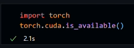
- Instalación de la librería `ultralytics`
  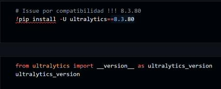
- Definición de la ruta del dataset  
  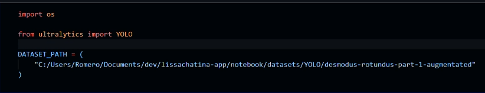
- Métodos de entrenamiento  
  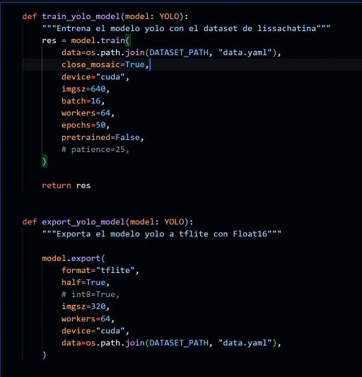
- Carga del modelo **YOLOv11n**  
  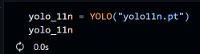
- Ejecución del entrenamiento  
  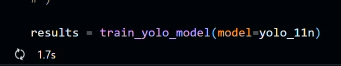
- Visualización de los resultados obtenidos  
  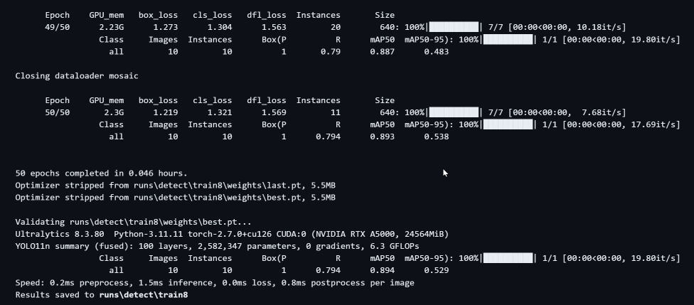

### Apartado de Predicción

- Instalación de librerías necesarias  
  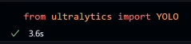
- Carga del modelo YOLO entrenado  
  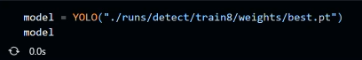
- Testeo del modelo con una imagen fuera del dataset proporcionado  
  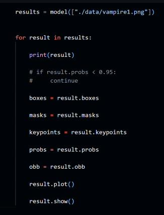
- Visualización del resultado  
  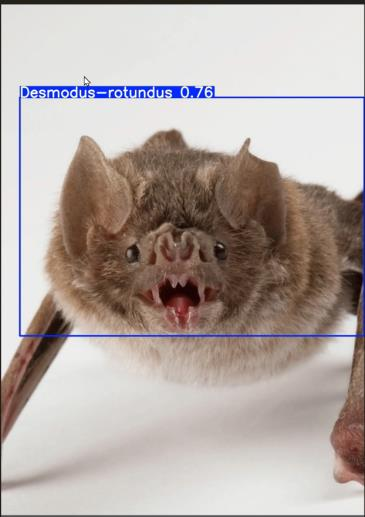

## Puntos Clave

- **`data.yaml`**:  
  Contiene:

  - Las clases (en este caso solo existe una, ya que se entrena únicamente con imágenes del murciélago vampiro).
  - Rutas de imágenes (ubicación de la carpeta con las imágenes del mismo tamaño).
  - Rutas de anotaciones (ubicación de la carpeta con los labels o coordenadas de las anotaciones de la especie).

- **`results.show()`**:  
  Visualiza la detección del murciélago en las imágenes procesadas.

## **Bibliografía**

- SENASA. (2024). SENASA vacunó más de 6 mil animales como prevención contra la rabia en Piura. <https://www.gob.pe/institucion/senasa/noticias/1045660-senasa-vacuno-mas-de-6-mil-animales-como-prevencion-contra-la-rabia-en-piura>
- SENASACONTIGO. (2018, enero 25). Senasa efectúa control poblacional de murciélagos hematófagos en Castrovirreyna. SENASA al día. <https://www.senasa.gob.pe/senasacontigo/senasa-efectua-control-poblacional-de-murcielagos-hematofagos-en-castrovirreyna/>
- SENASACONTIGO. (2021, noviembre 18). VRAEM: Control de murciélagos hematófagos en resguardo de la ganadería familiar. SENASA al día. <https://www.senasa.gob.pe/senasacontigo/vraem-control-de-murcielagos-hematofagos-en-resguardo-de-la-ganaderia-familiar/>
