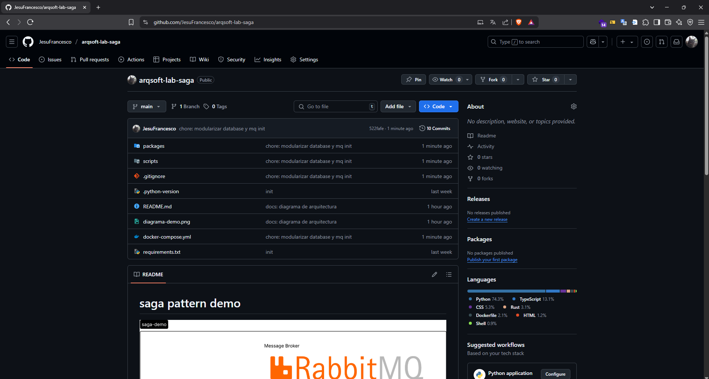

# Amoretti - Patrón Cloud Saga

Nota. Obtenido de [GeeksForGeeks, s.f.](https://www.geeksforgeeks.org/saga-design-pattern/)

## Problema

En arquitecturas basadas en microservicios, las transacciones distribuidas son un gran desafío. Tradicionalmente, una transacción se ejecuta de manera atómica, consistente, aislada y duradera (ACID), pero cuando una operación involucra múltiples servicios independientes, mantener estas propiedades se vuelve complejo.

ibuidos\*\* sin depender de un gestor de transacciones centralizado, el cual no escala bien en ambientes cloud-native y desacoplados.

La lista de problemas que aborda contiene, pero no se limita a:

- **Falta de soporte para transacciones distribuidas ACID** entre microservicios.
- **Necesidad de garantizar consistencia eventual** en entornos desacoplados.
- **Complejidad en el manejo de fallos parciales**, donde un servicio puede fallar sin impactar toda la operación global.

Nota. Obtenido de DataBricks, s.f.

## Solución

El patrón **Cloud Saga** propone descomponer una transacción larga en una **secuencia de transacciones locales** que se ejecutan en cada servicio, coordinadas mediante eventos o comandos.  
Cada paso de la saga realiza una operación local y, en caso de fallos, se deben ejecutar acciones compensatorias para deshacer los efectos previos y restaurar la consistencia del sistema.

Existen dos variantes principales:

- **Sagas coreografiadas**: cada servicio publica eventos que los demás escuchan para reaccionar. No hay un orquestador central. Es útil cuando se desea menor acoplamiento.
- **Sagas orquestadas**: un orquestador central gestiona la lógica de la saga, indicando a cada servicio cuándo ejecutar su acción o compensación.

Nota. Obtenido de [IngenieroBinario, 2025](https://www.ingenierobinario.com/mulesoftarchitect83/)

### Ventajas frente a enfoques tradicionales:

- Promueve **desacoplamiento y autonomía de servicios**.
- Favorece la **escalabilidad horizontal**, ya que no depende de un coordinador de transacciones distribuido.
- Compatible con entornos asincrónicos y basados en eventos (event-driven architecture).
- Manejo explícito de **acciones compensatorias**.

### Rol de RabbitMQ como Message Broker

RabbitMQ desempeña un papel clave en la implementación del patrón Saga, especialmente en su variante coreografiada. Como sistema de mensajería basado en colas, permite a los microservicios comunicarse de forma asincrónica mediante el intercambio de eventos. Sus características relevantes incluyen:

- **Desacoplamiento** entre emisores y receptores, lo que permite a los servicios evolucionar de forma independiente.
- **Entrega garantizada de mensajes** mediante mecanismos de confirmación y reintento.
- **Intercambios (exchanges)** y **rutas (bindings)** configurables para enrutar eventos a múltiples consumidores según su tipo.
- **Colas durables y persistencia** que garantizan la resistencia ante caídas del sistema.
- **Dead-letter queues**, útiles para manejar fallos en la entrega de mensajes y activar acciones compensatorias.

RabbitMQ es especialmente útil para:

- Enviar eventos de éxito o fallo entre servicios en una saga coreografiada.
- Recibir comandos del orquestador en una saga orquestada.
- Implementar patrones como _publish/subscribe_, _fanout_ o _topic routing_ para distribuir eventos a varios servicios relacionados con una saga.

### Complementando con otras plataformas:

- **AWS Step Functions**, **Azure Durable Functions** y **Temporal.io** proveen infraestructura de orquestación para implementar sagas de forma declarativa.
- **Netflix Conductor** y **Camunda** son soluciones más completas para flujos complejos con soporte de compensaciones.
- **Apache Kafka** y **Debezium** permiten implementar sagas coreografiadas sobre plataformas de streaming.

Nota. Obtenido de [Medium, 2022](https://medium.com/aws-lambda-serverless-developer-guide-with-hands/saga-pattern-for-orchestrate-distributed-transactions-using-aws-step-functions-2513db0de84e)

## Casos de Aplicación

### 1. **Sector Financiero - Gestión de Pagos**

Un sistema de pagos en línea puede implicar verificar fondos, bloquear dinero, transferir a otro banco y notificar la operación. Cada uno es un microservicio. Si la transferencia falla, es necesario revertir el bloqueo.

**El patrón Saga permite coordinar estas operaciones manteniendo consistencia sin bloquear recursos.**

### 2. **Comercio Electrónico - Procesamiento de Órdenes**

Cuando un cliente realiza un pedido, los servicios de inventario, pago y envío deben coordinarse. Si el pago falla, se debe liberar el stock. Si el envío falla, se debe devolver el dinero.

**Las sagas permiten que cada microservicio actúe de forma autónoma con lógica compensatoria.**

### 3. **Startups SaaS - Suscripciones y Facturación**

Una aplicación SaaS puede tener flujos donde se crea una cuenta, se genera una suscripción, se aplica un descuento y se factura. Si cualquier paso falla (como la validación de tarjeta), se requiere deshacer los anteriores.

**Implementar una saga permite manejarlo sin afectar la experiencia del usuario.**

### 4. **Logística y Transporte - Coordinación de Entregas**

En servicios como Uber o aplicaciones de entrega, se coordina el registro de la orden, asignación del conductor, validación del punto de recogida y confirmación de entrega. Si una parte falla (conductor cancela), se requiere compensar las anteriores (cancelar orden, devolver saldo).

**Las sagas aseguran que la experiencia del cliente no se vea comprometida por fallos parciales.**

## Demo de código

[Repositorio con código fuente](https://github.com/JesuFrancesco/arqsoft-lab-saga)

---

# Referencias

Microservices Pattern: Pattern: Saga. (s. f.). microservices.io. Recuperado 11 de junio de 2025, de http://microservices.io/patterns/data/saga.html

RobBagby. (s. f.). Saga Design Pattern—Azure Architecture Center. Recuperado 11 de junio de 2025, de https://learn.microsoft.com/en-us/azure/architecture/
patterns/saga

SAGA Design Pattern. (09:46:38+00:00). GeeksforGeeks. https://www.geeksforgeeks.org/saga-design-pattern/

The pros and cons of the Saga architecture pattern. (s. f.). Recuperado 11 de junio de 2025, de https://www.redhat.com/en/blog/pros-and-cons-saga-architecture-pattern
