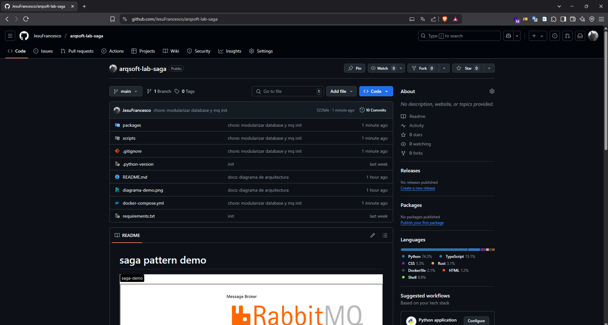

# Patrón de Arquitectura Sidecar

## Definición

El patrón Sidecar es un patrón de arquitectura en el que una funcionalidad auxiliar se implementa en un contenedor o proceso separado que despliega junto al servicio principal, compartiendo el mismo entorno de ejecución, como un Pod en Kubernetes. arquitectura permite extender la capacidad del servicio sin modificar su código fuente, lo que ayuda a incrementar la reutilización, la separación de las responsabilidades y la observabilidad del mismo (Microsoft, s.f.; Gillis, 2022).

## Problema

En arquitecturas modernas de microservicios, es habitual que múltiples servicios soliciten las mismas funcionalidades, como por ejemplo, las siguientes: observabilidad, configuración, autenticación, enrutamiento o manejo de certificados. Repetir esta lógica en cada servicio conlleva a un alto acoplamiento, duplicación de código y mayor complejidad en el mantenimiento.  
Así mismo, cambiar o actualizar las funcionalidades que están compartidas requiere trabajar en todos los servicios, generando posibles incoherencias y errores (Microsoft, s.f.).

## Solución

El patrón Sidecar propone desacoplar estas funcionalidades auxiliares de los servicios principales, encapsulándolas en contenedores independientes para ejecutarse junto al servicio en el mismo entorno, como es el caso de Kubernete (Microsoft, s.f.).

Este contenedor "acompañante" tendrá el mismo ciclo de vida que el servicio principal, lo que permite extenderlo o enriquecerlo sin necesidad de modificar su código directamente (Gillis, 2022).

Entre las capacidades comunes delegadas al sidecar están:

- Logging centralizado
- Balanceo de carga
- Proxy de red (service mesh)
- Manejo de certificados y credenciales
- Observabilidad y métricas

Este patrón se apoya fuertemente en plataformas como Kubernetes, donde cada Pod puede contener múltiples contenedores que comparten recursos de red y almacenamiento (Red Hat, 2021).

### Ventajas

- Separación de responsabilidades.
- Reutilización de lógica auxiliar.
- Facilita actualizaciones y mantenimiento.
- Mejora la observabilidad y la seguridad sin acoplar al código de negocio (Microsoft, s.f.; Red Hat, 2021).

## Casos de Aplicación

### 1. Service Mesh con Istio y Envoy

En un entorno de Kubernetes, Istio utiliza el patrón Sidecar para implementar un data plane utilizando el proxy Envoy, el cual tiene el efecto de un sidecar que intercepta el tráfico tanto a la entrada como a la salida del servicio, lo que permite observar el tráfico y la posibilidad de enrutamiento dinamico, controlar el tráfico, manejar TLS mutuo y definir nuevas políticas de seguridad sin que el servicio tenga que conocer la implementación de estas (Gillis, 2022).

### 2. Startups SaaS (Software como Servicio)

Una startup que desarrolla una aplicación SaaS multicliente puede utilizar un sidecar para realizar una centralización de la gestión de la autenticación/ autorización JWT para todos los servicios. Esto simplifica el desarrollo del equipo backend, ayudando a que puedan enfocarse únicamente en la lógica de negocio (Microsoft, s.f.).

### 3. Empresas Financieras

En sistemas bancarios donde es necesario tener un servicio en modo de operación permanente por regulación, se puede implementar un sidecar que recolectará logs, métricas de latencia y errores para enviarlos posteriormente a un servicio de monitorización, como puede ser Prometheus o Datadog, evitando de esta manera cargar al servicio primario en la recopilación de esta información (Red Hat, 2021).

### 4. Procesamiento de Medios o Archivos

Un servicio que procesa imágenes o videos puede apoyarse en un sidecar encargado de comprimir, convertir o almacenar los archivos en un sistema de archivos distribuido (como Amazon S3). Esto permite escalar independientemente la lógica de negocio y el procesamiento multimedia por separado (Microsoft, s.f.).

## Demo de código

[Repositorio con código fuente](https://github.com/JesuFrancesco/arqsoft-lab-saga)

---

## Referencias

- Gillis, A. S. (2022, noviembre 16). *What is a sidecar proxy?* TechTarget. <https://www.techtarget.com/searchitoperations/definition/sidecar-proxy>

- Microsoft. (s.f.). *Sidecar pattern*. Azure Architecture Center. <https://learn.microsoft.com/en-us/azure/architecture/patterns/sidecar>

- Red Hat. (2021). *Service mesh: The sidecar pattern explained*. Red Hat. <https://www.redhat.com/en/topics/microservices/what-is-a-service-mesh>
