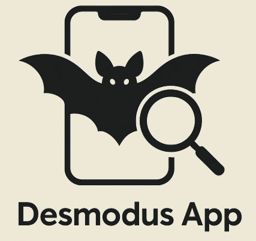
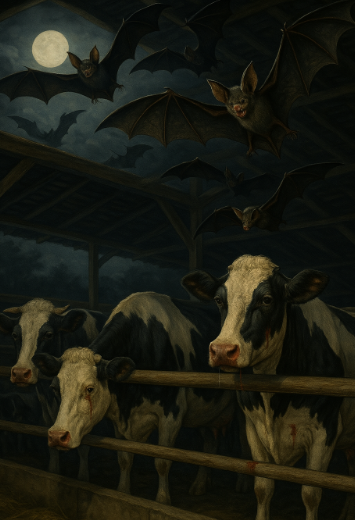

# 1.1. Generalidades

## 1.1. Generalidades

### Información General

**Nombre de la app**: “Desmodus App”

**Descripción**: Desmodus App es una innovadora aplicación móvil diseñada para la identificación del murciélago vampiro (Desmodus rotundus), una especie considerada plaga debido a su impacto negativo en animales de granja y su potencial de transmisión de la rabia a los seres humanos.

Utilizando la cámara del dispositivo y tecnología de visión computacional avanzada mediante modelos como YOLO 12, la aplicación permite detectar de manera rápida y precisa la presencia de esta especie. Además, Desmodus App incorpora un mapa interactivo que muestra las zonas geográficas donde se reporta con mayor frecuencia la presencia del Desmodus rotundus, brindando a los usuarios una herramienta útil para la prevención y el monitoreo.

Esta aplicación está pensada para apoyar a agricultores, veterinarios, investigadores y autoridades sanitarias en el control de esta especie, contribuyendo así a la salud pública y al bienestar animal.

**Problemática identificada**: La Organización de las Naciones Unidas para la Alimentación y la Agricultura (FAO) comunica que el murciélago vampiro (Desmodus rotundus) se ha convertido en una especie de riesgo a lo largo del mundo, esto se debe a su estricta alimentación de sangre (FAO, 2019).

De la misma forma, la Organización Internacional Regional de Sanidad Agropecuaria (OIRSA) señala que la expansión ganadera y la deforestación han facilitado el aumento de la interacción del murciélago vampiro con el ganado, elevando los riesgos de transmisión de enfermedades (OIRSA, 2021).

Según el Servicio Nacional de Sanidad Agraria (SENASA), los murciélagos vampiros (Desmodus rotundus) están presentes en diversas regiones del Perú, como Huancavelica, Piura y el Valle de los ríos Apurímac, Ene y Mantaro (VRAEM). En estas áreas, el SENASA ha implementado programas de control poblacional y monitoreo para prevenir los riesgos asociados a la rabia transmitida por esta especie (SENASA, 2024; SENASACONTIGO, 2018, 2021). Estadísticos desde el año 2016 hasta el 2024 señalan que un total de 1574 animales murieron a causa de la rabia transmitida por esta especie (SENASA, 2024).

El murciélago vampiro representa una amenaza significativa tanto para el ganado como para los seres humanos debido a su rol como portador del virus de la rabia (Albuquerque et al., 2024), una enfermedad viral altamente mortal causada por un virus neurotrópico del género Lyssavirus, familia Rhabdoviridae (Sánchez et al., 2020). Este virus presenta una letalidad del 100 % una vez que se manifiestan los síntomas clínicos, y el tiempo de incubación en bovinos varía entre 25 días y 5 meses (Spickler, 2021).

La transmisión de la rabia ocurre principalmente a través de mordeduras o contacto con saliva infectada, lo que facilita la propagación del virus (Novaes et al., 2024). Este riesgo es particularmente preocupante debido a que un solo incidente de mordedura puede llevar a la rápida diseminación de la enfermedad entre animales y personas (Romero-Sandoval et al., 2014).

Además de los efectos directos sobre la salud, la rabia en el ganado provoca pérdidas económicas considerables para los ganaderos, debido a la elevada mortalidad y disminución de la productividad que trajo esta en las áreas afectadas (Anderson et al., 2014).

Dado el impacto del murciélago vampiro en la salud pública y la ganadería, se propone desarrollar un modelo basado en visión computacional para su identificación y seguimiento. Este utilizará imágenes térmicas integradas en un modelo YOLO, como sugieren Wu et al. (2024), para mejorar la precision en condiciones de baja luminosidad. La implementación se realizará en una aplicación móvil, lo que permitirá a los usuarios identificar y monitorear esta especie, contribuyendo a su control poblacional en Perú.

---

### Estructura de la Solución

1. **Módulo de autorización (por google, facebook, email)**

**Registro mediante correo electrónico**: El usuario será capaz de iniciar sesión al aplicativo con su correo electrónico, caso contrario podrá acceder a opcionaes limitadas del sistema.

**Registro mediante proveedores de OAUTH2.0**: El usuario será capaz de iniciar sesión al aplicativo utilizando algún proveedor OAUTH que tenga, caso contrario podrá acceder a opcionaes limitadas del sistema.

**Vinculación automática de datos personales**: los datos personales se obtendrán de forma automática gracias al uso de un proveedor OAUTH y el uso de su REST API.
Edicición de datos personales: el usuario puede ser capaz de editar sus credenciales de ser necesario.

2. **Módulo de noticias**

**Noticias relacionadas con la especie problemática a tratar**: El usuario debe ser capaz de ver un apartado de noticias relacionadas a la especie problemática.

**Ver los detalles de la noticia**: El usuario será capaz de ver detalles de la noticia y entrar a hipervínculos de ser necesario.

**Creación de comentarios de noticias**: El usuario será capaz de escribir comentarios sobre las publicaciones de noticias.

3. **Módulo de modelo de detección de objetos (YOLO v12) con cámara**

**Cámara con un detector de objetos**: El usuario será capaz de utilizar un modelo de detección de objetos para identificar a la especie problemática.

**Capacidad de hacer zoom in y zoom out**: El usuario podrá hacer un zoom out y zoom in de su cámara para detectar la especie a distancia.

**Capacidad de usar cámara frontal o trasera**: El usuario podrá utilizar tanto su cámara frontal como trasera para realizar las predicciones de ML.

4. **Módulo de mapa**
   **Mapa con GPS que muestra la ubicación en tiempo real**: El usuario podrá visualizar su ubicación actual en el mapa mediante el uso del GPS del dispositivo.

**Mapa de calor con los avistamientos de la especie por la zona**: Se mostrará un mapa de calor indicando las zonas con mayor frecuencia de avistamientos de la especie problemática, basado en los reportes de los usuarios.

**Mapa que pueda mostrar fotos de los diferentes avistamientos por otros usuarios**: El usuario podrá visualizar en el mapa fotos geolocalizadas que otros usuarios hayan subido sobre avistamientos de la especie.

5. **Módulo de chatbot / asistente LLM**

**Sección de chat que permite comunicarte con un chatbot especialista en la problemática**: El usuario podrá interactuar con un asistente conversacional inteligente capaz de responder preguntas, brindar recomendaciones y proporcionar información útil sobre la especie problemática y su control.

---

## Referencias bibliográficas:

Albuquerque, N. K., Silva, S. P., Aragão, C. F., Cunha, T. C. A. S., Paiva, F. A. S., Coelho, T. F. S. B., & Cruz, A. C. R. (2024). Virome analysis of Desmodus rotundus tissue samples from the Amazon region. BMC Genomics, 25(1), 34. https://doi.org/10.1186/s12864-023-09950-w

Anderson, A., Shwiff, S., Gebhardt, K., Ramírez, A. J., Shwiff, S., Kohler, D., & Lecuona, L. (2014). Economic Evaluation of Vampire Bat ( Desmodus rotundus) Rabies Prevention in Mexico. Transboundary and Emerging Diseases, 61(2), 140–146. https://doi.org/10.1111/tbed.12007

FAO. (2019). Decreto No 24.405-MAG - Control obligatorio del Desmodus rotundus, conocido como vampiro. | FAOLEX. https://www.fao.org/faolex/results/details/en/c/LEX-FAOC009576/

Novaes, R. L. M., Almeida, B., Cláudio, V. C., Costa-Neto, S. F., Couto, A. L. G., Schmidt, E., Bertocchi, N. A., Costa, J. O., Ferreira, C. F., De Oliveira, A. M. R., Dos Santos, M. L. M., Monteverde, T. S. D., De Abreu, E. M. N., Cunha, E. N. P., Borges, A. R., Garcia, J. G., Barboza, C. M., Cocchi, M., Batista, H. B. C. R., & Moratelli, R. (2024). Rabies virus circulation in a highly diverse bat assemblage from a high-risk area for zoonoses outbreaks in the Brazilian Amazon. Acta Tropica, 257, 107309. https://doi.org/10.1016/j.actatropica.2024.107309

OIRSA. (2021). PRESENTACION
IMPACTO SANITARIO Y ECONOMICO CURSO RABIA OIRSA HONDURAS 2021. https://www.oirsa.org/contenido/2020-2/2021/Rabia_Paralitica_Bovina/PRESENTACION%20%20IMPACTO%20SANITARIO%20Y%20ECONOMICO%20CURSO%20RABIA%20OIRSA%20HONDURAS%202021.pdf

Romero-Sandoval, N., Escobar, N., Utzet, M., Feijoo-Cid, M., & Martin, M. (2014). Sylvatic rabies and the perception of vampire bat activity in communities in the Ecuadorian Amazon. Cadernos de Saúde Pública, 30(3), 669–674. https://doi.org/10.1590/0102-311X00070413

Sánchez, M. D. P., Sanmiguel, R. A., Díaz Sanchez, O. A., Ramirez, A. A., & Escobar, L. (2020). Rabia en las Américas, varios desafíos y “Una Sola Salud”: Artículo de revisión. Revista de Investigaciones Veterinarias del Perú, 30(4), 1361–1381. https://doi.org/10.15381/rivep.v30i4.17150

SENASA. (2024). SENASA vacunó más de 6 mil animales como prevención contra la rabia en Piura. https://www.gob.pe/institucion/senasa/noticias/1045660-senasa-vacuno-mas-de-6-mil-animales-como-prevencion-contra-la-rabia-en-piura

SENASACONTIGO. (2018, enero 25). Senasa efectúa control poblacional de murciélagos hematófagos en Castrovirreyna. SENASA al día. https://www.senasa.gob.pe/senasacontigo/senasa-efectua-control-poblacional-de-murcielagos-hematofagos-en-castrovirreyna/

SENASACONTIGO. (2021, noviembre 18). VRAEM: Control de murciélagos hematófagos en resguardo de la ganadería familiar. SENASA al día. https://www.senasa.gob.pe/senasacontigo/vraem-control-de-murcielagos-hematofagos-en-resguardo-de-la-ganaderia-familiar/

Spickler, A. R. (2021). Rabies and Rabies-Related Lyssaviruses. The Center for Food Security & Public Health. https://www.cfsph.iastate.edu/Factsheets/pdfs/rabies.pdf

Wu, D., Ying, Y., Zhou, M., Pan, J., & Cui, D. (2024). YOLO-Claw: A fast and accurate method for chicken claw detection. Engineering Applications of Artificial Intelligence, 136, 108919. https://doi.org/10.1016/j.engappai.2024.108919

Zhang, C., Bracke, M., Da Silva Torres, R., & Gansel, L. C. (2024). Rapid detection of salmon louse larvae in seawater based on machine learning. Aquaculture, 592, 741252. https://doi.org/10.1016/j.aquaculture.2024.741252

Zhou, C., Wang, C., Sun, D., Hu, J., & Ye, H. (2025). An automated lightweight approach for detecting dead fish in a recirculating aquaculture system. Aquaculture, 594, 741433. https://doi.org/10.1016/j.aquaculture.2024.741433
