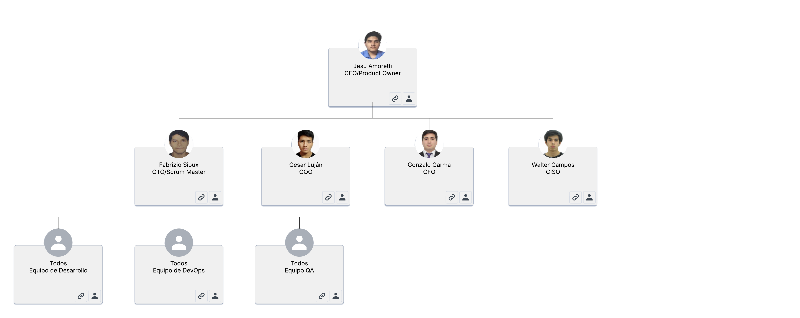

# 1.3. Estructura del Equipo

| **Roles** | **Persona Asignada**  | **Descripción**                                                                                                                       |
| ----- | ----------------  | --------------------------------------------------------------------------------------------------------------------------------- |
| CEO   | Jesu Amoretti     | Define la misión, visión y estrategia general del proyecto. Toma decisiones claves y es el representante del proyecto.            |
| CTO   | Fabrizio Sioux    | Diseña y lidera la estrategia tecnológica del proyecto. Asegura que el desarrollo del producto sea escalable, segura y eficiente. |
| COO   | Cesar Luján       | Supervisar las operaciones diarias del proyecto. Es el responsable de asegurar las entregas a tiempo. Además, implementa estrategias para mejorar la eficiencia y la calidad del producto. |
| CFO   | Gonzalo Garma     | Es el encargado de gestionar las finanzas del proyecto. Asegura el cumplimiento de las normativas contables y fiscales. |
| CISO  | Walter Campos     | Responsable de definir, implementar y supervisar la estrategia de ciberseguridad y la protección de la información. |
| Product Owner | Jesu Amoretti | Representa al cliente y al negocio dentro del equipo. Es el responsable de maximizar el valor del producto y gestionar el backlog. |
| Scrum Master  | Fabrizio Sioux | Se encarga de que el equipo siga las reglas de SCRUM dentro del proyecto. Facilita los eventos y ceremonias dentro del equipo (Daily, Sprint Planning, Retrospective, etc.). |
| Equipo de desarrollo | Todos | Son quienes desarrollan el producto. Se encargan de construir los incrementos funcionales en cada Sprint. |
| Equipo DevOps | Todos | Se encarga de integrar el desarrollo con las operaciones para lograr entregas continuas, automatización y alta disponibilidad. |
| Equipo QA | Todos | Son los encargados de asegurar la calidad del producto mediante pruebas y validaciones antes de la entrega al cliente. |

---
En el siguiente enlace, podrás encontrar una imagen que visualiza mejor la estructura del equipo:

