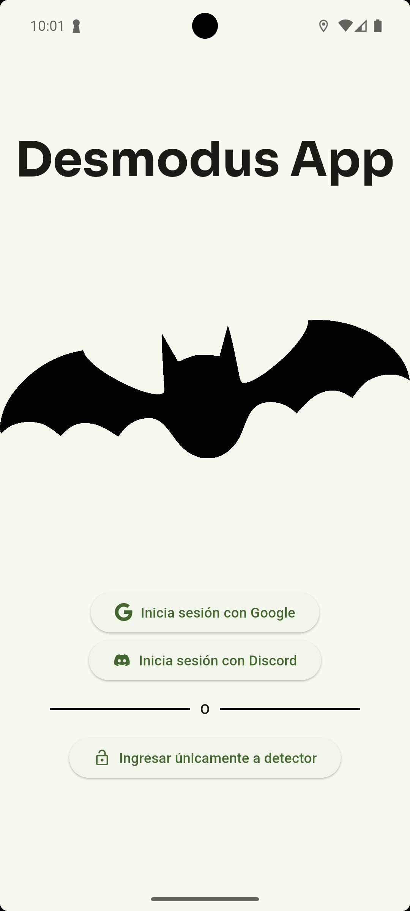
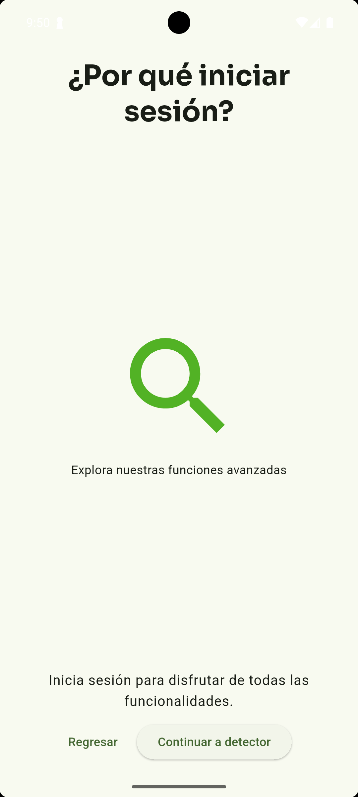
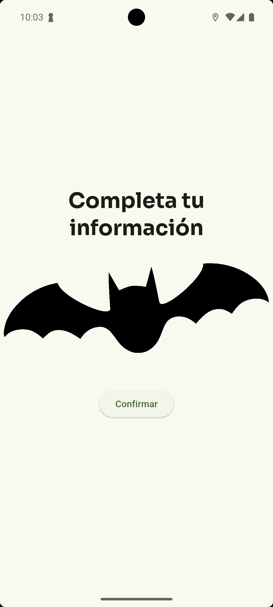
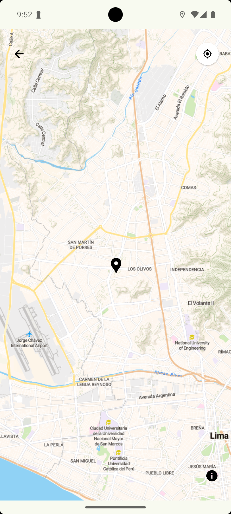
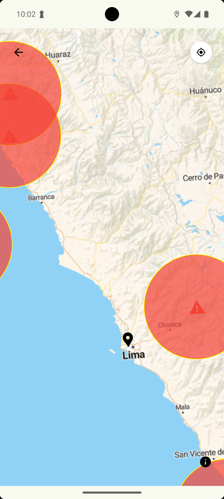
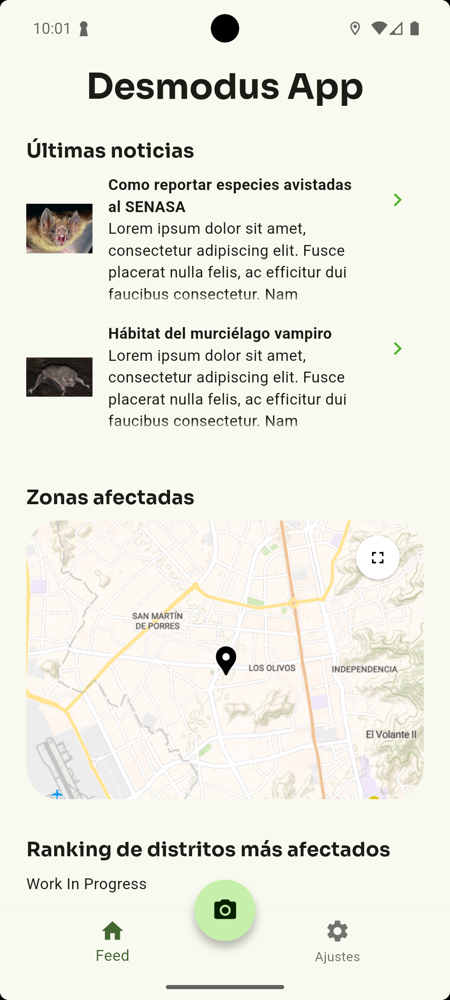
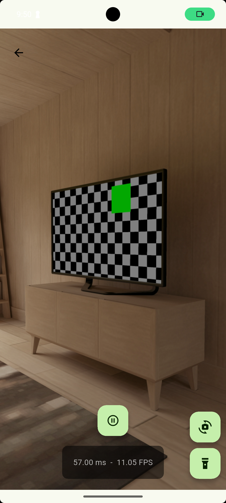
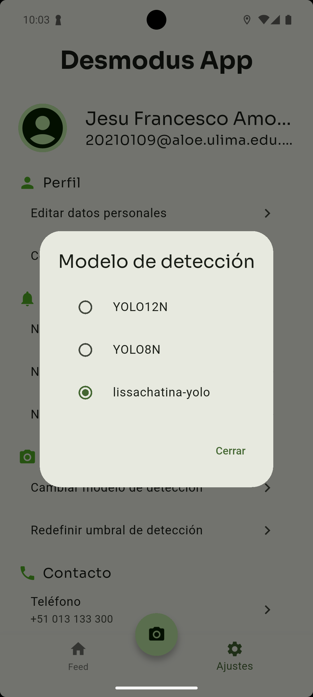
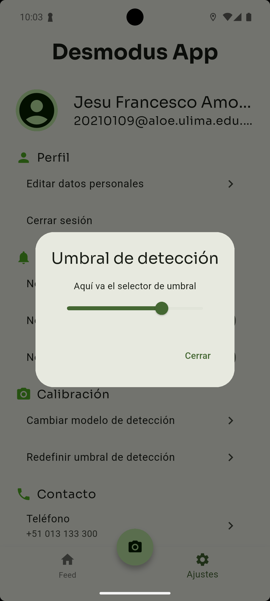

# 2.1. Requerimientos Funcionales

---

## Módulo 01 - Autenticación y Autorización (OAuth)

| ID     | Nombre                   | Historia de Usuario                                                                                                                                          |
| ------ | ------------------------ | ------------------------------------------------------------------------------------------------------------------------------------------------------------ |
| RF 1.1 | Registro con Google      | Como usuario, quiero registrarme e iniciar sesión con mi cuenta de Google, para acceder rápidamente a la plataforma sin necesidad de crear una cuenta nueva. |
| RF 1.2 | Registro con Facebook    | Como usuario, quiero registrarme con Facebook, para utilizar mis credenciales existentes y agilizar el ingreso.                                              |
| RF 1.3 | Registro con Discord      | Como usuario técnico o investigador, quiero iniciar sesión con mi cuenta de Discord, para acceder de forma segura usando una cuenta que ya utilizo.           |
| RF 1.4 | Gestión de Sesión Segura | Como usuario, quiero que mis sesiones sean seguras y tengan expiración automática, para proteger mi información en caso de inactividad.                      |

    
    
    

---

## Módulo 02 - Chat y Chatbot (LLM)

| ID     | Nombre                      | Historia de Usuario                                                                                                                                      |
| ------ | --------------------------- | -------------------------------------------------------------------------------------------------------------------------------------------------------- |
| RF 2.1 | Chat con Expertos           | Como usuario, quiero comunicarme con expertos sobre la especie plaga detectada, para recibir orientación sobre cómo actuar.                              |
| RF 2.2 | Asistente Virtual (LLM)     | Como usuario, quiero consultar al chatbot sobre síntomas o comportamientos de la especie murciélago plaga, para obtener respuestas rápidas y confiables. |
| RF 2.3 | Reporte mediante Chatbot    | Como usuario, quiero poder reportar una detección directamente desde el chat, para agilizar el proceso sin llenar formularios.                           |
| RF 2.4 | Historial de Conversaciones | Como usuario, quiero ver el historial de mis conversaciones con el chatbot o expertos, para dar seguimiento a los consejos o reportes previos.           |

    

---

## Módulo 03 - Mapa con GPS y Calor de Detecciones

| ID     | Nombre                             | Historia de Usuario                                                                                                                                           |
| ------ | ---------------------------------- | ------------------------------------------------------------------------------------------------------------------------------------------------------------- |
| RF 3.1 | Mapa de Calor de Detecciones       | Como usuario, quiero visualizar un mapa con zonas de alta incidencia de la especie plaga, para conocer las áreas más afectadas.                               |
| RF 3.2 | Geolocalización de Reportes        | Como usuario, quiero enviar mi ubicación al momento de reportar una detección, para ayudar a generar el mapa de calor en tiempo real.                         |
| RF 3.3 | Filtros por Fecha y Región         | Como usuario, quiero filtrar las detecciones por rango de fechas y región geográfica, para analizar el comportamiento de la especie a lo largo del tiempo.    |
| RF 3.4 | Visualización de Rutas Migratorias | Como investigador, quiero visualizar posibles rutas migratorias de la especie plaga basadas en los datos recolectados, para entender mejor su comportamiento. |

    
    

---

## Módulo 04 - Noticias y Alertas

| ID     | Nombre                          | Historia de Usuario                                                                                                                        |
| ------ | ------------------------------- | ------------------------------------------------------------------------------------------------------------------------------------------ |
| RF 4.1 | Noticias sobre la Especie       | Como usuario, quiero ver noticias actualizadas sobre la especie plaga, para mantenerme informado sobre eventos, descubrimientos y alertas. |
| RF 4.2 | Alertas por Zonas Críticas      | Como usuario, quiero recibir alertas si estoy en una zona con alta presencia de la especie, para tomar precauciones necesarias.            |
| RF 4.3 | Notificaciones en Tiempo Real   | Como usuario, quiero recibir notificaciones en tiempo real de noticias urgentes o nuevas detecciones en mi área, para actuar con rapidez.  |
| RF 4.4 | Marcado de Noticias Importantes | Como usuario, quiero marcar como importantes ciertas noticias, para revisarlas después o compartirlas con otros usuarios interesados.      |

    

---

## Módulo 05 - Cámara y Detección Automática de Especie

| ID     | Nombre                          | Historia de Usuario                                                                                                                                       |
| ------ | ------------------------------- | --------------------------------------------------------------------------------------------------------------------------------------------------------- |
| RF 5.1 | Captura de Imagen con la Cámara | Como usuario, quiero tomar una foto del animal sospechoso con la cámara del dispositivo, para reportar una posible detección de la especie plaga.         |
| RF 5.2 | Detección Automática con IA     | Como usuario, quiero que la app identifique automáticamente si la especie en la foto es la plaga en cuestión, para confirmar rápidamente la detección.    |
| RF 5.3 | Reporte de Detección Validado   | Como usuario, quiero generar un reporte automático si la especie es identificada por la IA, para contribuir con datos confiables al sistema de monitoreo. |
| RF 5.4 | Registro Histórico de Capturas  | Como usuario, quiero tener acceso a un historial de mis capturas y detecciones, para seguir la evolución de los avistamientos realizados por mí.          |

    
    
    

---
